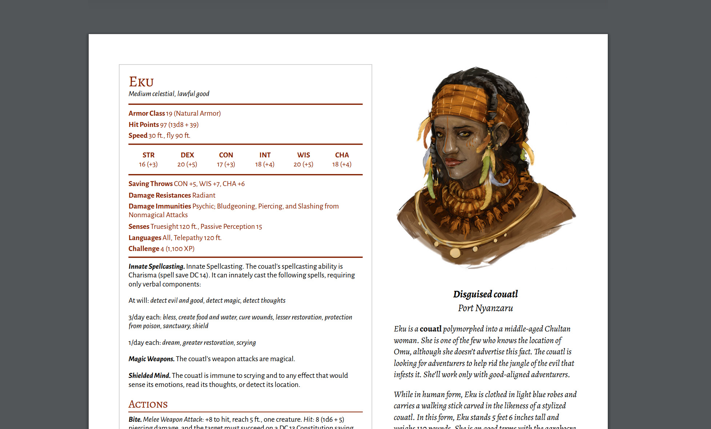

[View 👀](https://github.com/claflamme/toa-guide-printouts/blob/master/guides.pdf) or
[Download ⬇️](https://github.com/claflamme/toa-guide-printouts/raw/master/guides.pdf)

# Tomb of Annihilation Guide Printouts

I thought it was kind of shitty that the wilderness guides in ToA didn't have their own stat blocks. Their description tells you which monster stat block they use, but then also adds a bunch of modifications and overrides for some of them. The end result is that you have to flip back and forth between the monster stat block and the guide description, which is super annoying.

So, here's a PDF with stat blocks for each recruitable wilderness guide (and their sidekicks) with all modifications applied, as well as their picture and the relevant parts of their character description.

## Made for Dungeon Masters

The printouts contain descriptions of the motivations and true identities of some of the guides, which is handy for when the DM needs to roleplay the characters. However,  Some of the information could spoil a few storylines so make sure you don't give them out to your players.

If you like your players to control NPC party members, you can still let them without handing over the printouts. Let your characters control the NPCs in combat and exploration by giving them simple commands which you, the DM, can then follow through on. For example: _"attack that"_, _"unlock this"_, _"lead us back to Port Nyanzaru"_.
